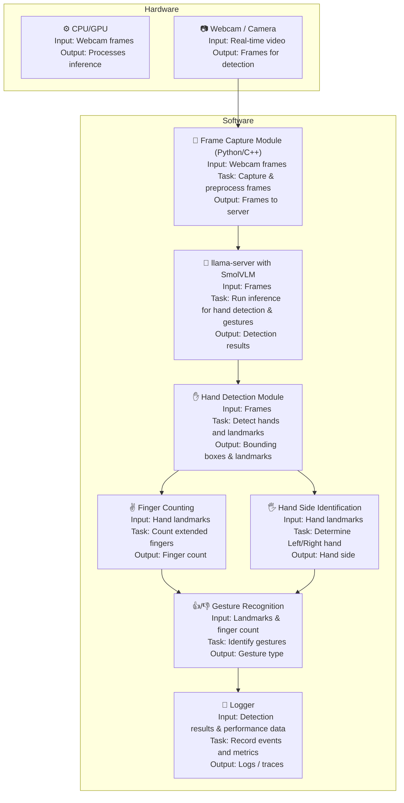

# System Architecture Diagram — smolVLM Motion Detection

```mermaid
graph TD

    %% Hardware
    subgraph Hardware
        CPU["⚙️ CPU/GPU
        Input: Webcam frames
        Output: Processes inference"]

        Webcam["📷 Webcam / Camera
        Input: Real-time video
        Output: Frames for detection"]
    end

    %% Software
    subgraph Software
        FrameCapture["🎥 Frame Capture Module (Python/C++)
        Input: Webcam frames
        Task: Capture & preprocess frames
        Output: Frames to server"]

        LLamaServer["🧩 llama-server with SmolVLM
        Input: Frames
        Task: Run inference for hand detection & gestures
        Output: Detection results"]

        HandDetection["✋ Hand Detection Module
        Input: Frames
        Task: Detect hands and landmarks
        Output: Bounding boxes & landmarks"]

        HandSide["🖐 Hand Side Identification
        Input: Hand landmarks
        Task: Determine Left/Right hand
        Output: Hand side"]

        FingerCounting["✌ Finger Counting
        Input: Hand landmarks
        Task: Count extended fingers
        Output: Finger count"]

        GestureRecognition["👍/👎 Gesture Recognition
        Input: Landmarks & finger count
        Task: Identify gestures
        Output: Gesture type"]

        Logger["📝 Logger
        Input: Detection results & performance data
        Task: Record events and metrics
        Output: Logs / traces"]
    end

    %% Connections
    Webcam --> FrameCapture
    FrameCapture --> LLamaServer
    LLamaServer --> HandDetection
    HandDetection --> HandSide
    HandDetection --> FingerCounting
    FingerCounting --> GestureRecognition
    HandSide --> GestureRecognition
    GestureRecognition --> Logger
```

