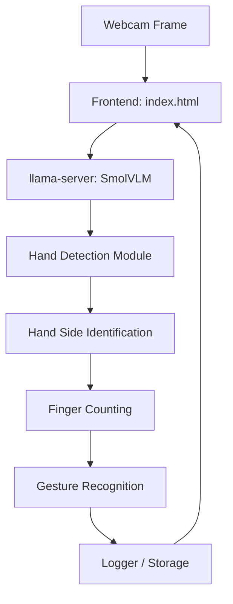

# Task 2 – Motion Detection with smolVLM

## 1. Overview

This project implements **real-time hand motion detection** using the SmolVLM model via a webcam feed.  
It detects:

- Hand presence  
- Hand side (Left/Right)  
- Finger count (0–5)  
- Simple gestures (`Thumbs Up` / `Thumbs Down`)  

It can be **integrated with an attendance system** for gesture-based presence confirmation.

---

## 2. Core Architecture

| Component | Responsibility |
|-----------|----------------|
| `llama-server` | Hosts SmolVLM model and performs inference on webcam frames. |
| SmolVLM Model | Performs real-time visual-language understanding of frames. |
| `index.html` | Frontend: captures webcam frames and displays predictions. |
| Hand Detection Module | Detects bounding boxes around hands using OpenCV / MediaPipe. |
| Hand Side Identification | Determines if detected hand is left or right. |
| Finger Counting | Counts the number of extended fingers. |
| Gesture Recognition | Detects gestures: Thumbs Up / Thumbs Down / Other. |
| Logger | Records detection events and system performance metrics. |

**Design Pattern**: Client-server with modular hand detection and inference pipeline.

---

## 3. Motion Detection Workflow

### 3.1 Hand Detection
- Detect hand bounding boxes using OpenCV / MediaPipe.
- Output: `"Hand Detected"` + coordinates.

### 3.2 Hand Side Identification
- Analyze landmarks to classify Left / Right hand.

### 3.3 Finger Counting
- Count extended fingers using landmark positions.

### 3.4 Gesture Recognition
- **Thumbs Up**: Thumb extended, others folded.  
- **Thumbs Down**: Thumb down, others folded.  
- Output: `"Gesture: Thumbs Up / Thumbs Down / Other"`.

### 3.5 Logging
- Extend logger to save gesture events and CPU/memory usage.

---

## 4. Component Interaction Diagram



---

## 5. Deployment & Setup Guide

### 5.1 Install llama.cpp
```bash
git clone https://github.com/ggerganov/llama.cpp
cd llama.cpp
make
```

### 5.2 Run SmolVLM Server
```bash
llama-server -hf ggml-org/SmolVLM-500M-Instruct-GGUF
```

- **Optional GPU Acceleration**:  
```bash
llama-server -hf ggml-org/SmolVLM-500M-Instruct-GGUF -ngl 99
```
- Other compatible models can be used by changing the `-hf` argument.

### 5.3 Open Frontend
- Open `index.html` in a browser.
- Click **Start** to capture webcam frames and display detection results.

### 5.4 Customize Instructions (Optional)
- Modify instructions to change output format (e.g., JSON) or detection behavior.

---

## 6. Extending for Attendance Repo

### 6.1 Integration Points
- Replace or complement face recognition frames with hand gestures.
- Detect gestures as confirmation of presence.

### 6.2 Implementation Steps
1. Add a module in the attendance repo to call the SmolVLM server.
2. Log gesture events alongside face recognition results.
3. Optionally combine face + gesture for dual-factor validation.

### 6.3 Benefits
- Real-time gesture-based attendance.
- Flexible extension for other gesture-triggered events.
- Easy logging and reporting.

---

## 7. Inputs & Outputs

| Input | Output |
|-------|--------|
| Live webcam frames | Hand Detected / No Hand |
| Hand landmarks | Left Hand / Right Hand |
| Finger positions | Finger Count (0–5) |
| Gesture detection | Thumbs Up / Thumbs Down / Other |

---

## 8. Notes & Recommendations
- Use MediaPipe Hands for reliable detection under different lighting.  
- Run inference on GPU for faster performance.  
- Extend logger for both gesture events and system metrics.

---

*End of Task 2 Documentation*