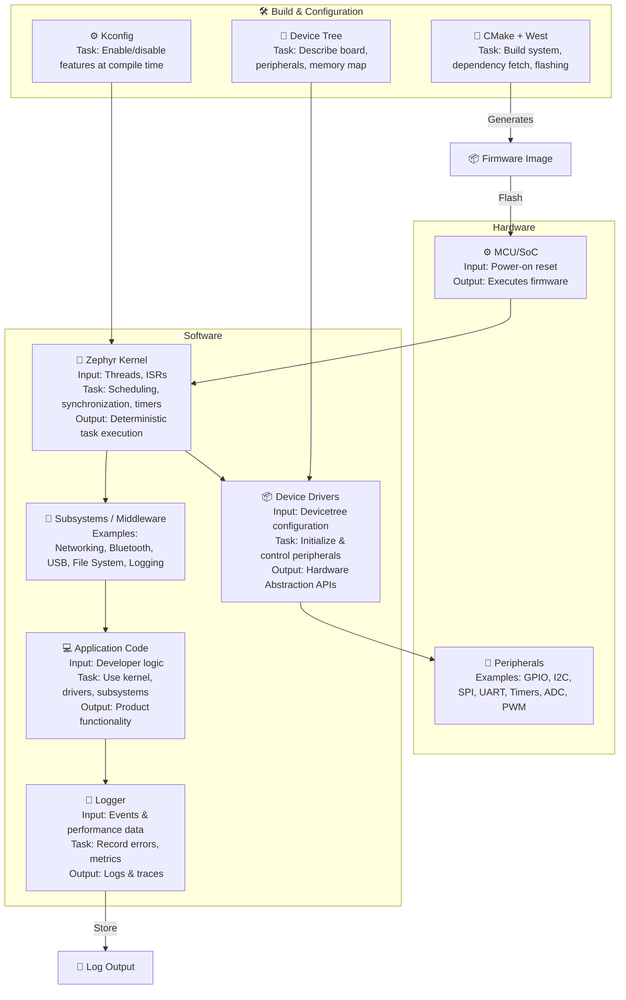

# System Architecture Diagram — Zephyr RTOS

```mermaid
graph TD

    %% Hardware
    subgraph Hardware
        CPU["⚙️ MCU/SoC
        Input: Power-on reset
        Output: Executes firmware"]

        Peripherals["🔌 Peripherals
        Examples: GPIO, I2C, SPI, UART, Timers, ADC, PWM"]
    end

    %% Software
    subgraph Software
        Kernel["🧩 Zephyr Kernel
        Input: Threads, ISRs
        Task: Scheduling, synchronization, timers
        Output: Deterministic task execution"]

        DeviceDrivers["📦 Device Drivers
        Input: Devicetree configuration
        Task: Initialize & control peripherals
        Output: Hardware Abstraction APIs"]

        Subsystems["🔗 Subsystems / Middleware
        Examples: Networking, Bluetooth, USB, File System, Logging"]

        Application["💻 Application Code
        Input: Developer logic
        Task: Use kernel, drivers, subsystems
        Output: Product functionality"]

        Logger["📝 Logger
        Input: Events & performance data
        Task: Record errors, metrics
        Output: Logs & traces"]
    end

    %% Build & Config
    subgraph Build_Config["🛠️ Build & Configuration"]
        Kconfig["⚙️ Kconfig
        Task: Enable/disable features at compile time"]

        Devicetree["🌳 Device Tree
        Task: Describe board, peripherals, memory map"]

        CMakeWest["📐 CMake + West
        Task: Build system, dependency fetch, flashing"]
    end

    %% Connections
    CPU --> Kernel
    Kernel --> DeviceDrivers
    DeviceDrivers --> Peripherals
    Kernel --> Subsystems
    Subsystems --> Application
    Application --> Logger
    Logger -->|Store| Logs["📄 Log Output"]

    Kconfig --> Kernel
    Devicetree --> DeviceDrivers
    CMakeWest -->|Generates| Firmware["📦 Firmware Image"]
    Firmware -->|Flash| CPU
```
