# Zephyr RTOS — Technical Architecture Overview

**Sources:** Zephyr GitHub, Zephyr Project documentation (Introduction, Build/CMake, Application Development, Drivers).

---

## 1. High-level description
- Zephyr is a scalable RTOS targeted at embedded and IoT devices with constrained resources.
- Supports many CPU architectures (ARM Cortex-M/A/R, RISC-V, x86, Xtensa, etc.).

---

## 2. Core components
1. **Kernel**
   - Preemptive RTOS kernel providing threads, scheduling, synchronization primitives (mutexes, semaphores), timers, and work queues.
   - Configurable footprint via Kconfig.
2. **Device model & drivers**
   - Device driver framework with device tree bindings and runtime device objects.
   - Bus/driver models integrated with build system; typical drivers: GPIO, I2C, SPI, UART, timers, ADC, PWM.
3. **Subsystems / Middleware**
   - Networking stacks (IPv4/IPv6, BLE, L2), Bluetooth stack, USB stack.
   - Filesystems (FatFs, LittleFS), settings and flash storage, DFU (firmware update) support.
4. **Configuration: Kconfig + Device Tree**
   - Kconfig (from Linux) for compile-time options.
   - Device Tree (DTS) used to describe boards/peripherals and generate platform bindings.
5. **Build System**
   - CMake-based application-centric build. Applications invoke Zephyr builds and produce single binaries (app + kernel).
   - `west` — meta-tool for workspace/repo management, fetching modules and flashing.
6. **Board support & modules**
   - Board folders, board-specific DTS and Kconfig fragments.
   - External modules/addons available as separate repos integrated via `west`.

---

## 3. Component interactions & data/control flow
- **Boot**: Minimal bootloader (or external) initializes CPU and memory, loads Zephyr image.
- **Initialization phase**:
  - Device Tree parsed at build time; devices initialized in dependency order at runtime via device init levels.
  - Kconfig-driven compile-time selection reduces footprint (tiny kernel configuration).
- **Runtime**:
  - The scheduler manages threads and interrupts. ISRs push short work to workqueues to avoid long ISR time.
  - Drivers expose device objects / APIs; subsystems call driver APIs (e.g., networking stack uses Ethernet/Wi-Fi driver).
- **Build-time integration**:
  - Application CMakeLists + board Kconfig + device tree produce a single ELF / hex firmware image to flash.

---

## 4. Deployment / usage (high level)
1. **Dev machine**: Linux / macOS / Windows (WSL recommended).
2. **Tooling**:
   - `west` to fetch modules and run builds.
   - CMake + Ninja to configure/build.
   - OpenOCD / vendor flasher to flash binary.
3. **Steps**:
   - `west init` / `west update` to get sources/modules.
   - `west build -b <board> samples/hello_world` (or custom app).
   - `west flash` to program hardware.

---

## 5. Security & quality
- Apache-2.0 licensing, community governance under Linux Foundation.
- Secure-by-design considerations: minimal trusted computing base, defined device privileges, TLS/crypto stacks available as modules.

---

# System Architecture Diagram — Zephyr RTOS

```mermaid
graph TD

    %% Hardware
    subgraph Hardware
        CPU["⚙️ MCU/SoC
        Input: Power-on reset
        Output: Executes firmware"]

        Peripherals["🔌 Peripherals
        GPIO, I2C, SPI, UART, Timers, ADC, PWM"]
    end

    %% Software
    subgraph Software
        Kernel["🧩 Zephyr Kernel
        Input: Threads, ISRs
        Task: Scheduling, synchronization, timers
        Output: Deterministic task execution"]

        DeviceModel["📦 Device Model & Drivers
        Input: Device Tree bindings
        Task: Init & manage hardware peripherals
        Output: APIs for subsystems"]

        Subsystems["🔗 Subsystems / Middleware
        Networking, Bluetooth, USB, FS, Logging"]

        Application["💻 Application Code
        Input: Developer logic
        Task: Use kernel & subsystems
        Output: Product functionality"]

        Logger["📝 Logger
        Input: Events & performance data
        Task: Record errors, metrics
        Output: Logs / traces"]
    end

    %% Build & Config
    subgraph Build_Config["🛠️ Build & Configuration"]
        Kconfig["⚙️ Kconfig
        Task: Compile-time feature selection"]

        Devicetree["🌳 Device Tree
        Task: Describe board & peripherals"]

        CMakeWest["📐 CMake + West
        Task: Build system, module fetch, flash"]
    end

    %% Connections
    CPU --> Kernel
    Kernel --> DeviceModel
    DeviceModel --> Peripherals
    Kernel --> Subsystems
    Subsystems --> Application
    Application --> Logger
    Logger -->|Store| Logs["📄 Log Output"]

    Kconfig --> Kernel
    Devicetree --> DeviceModel
    CMakeWest -->|Generates| Firmware["📦 Firmware Image"]
    Firmware -->|Flash| CPU
```

